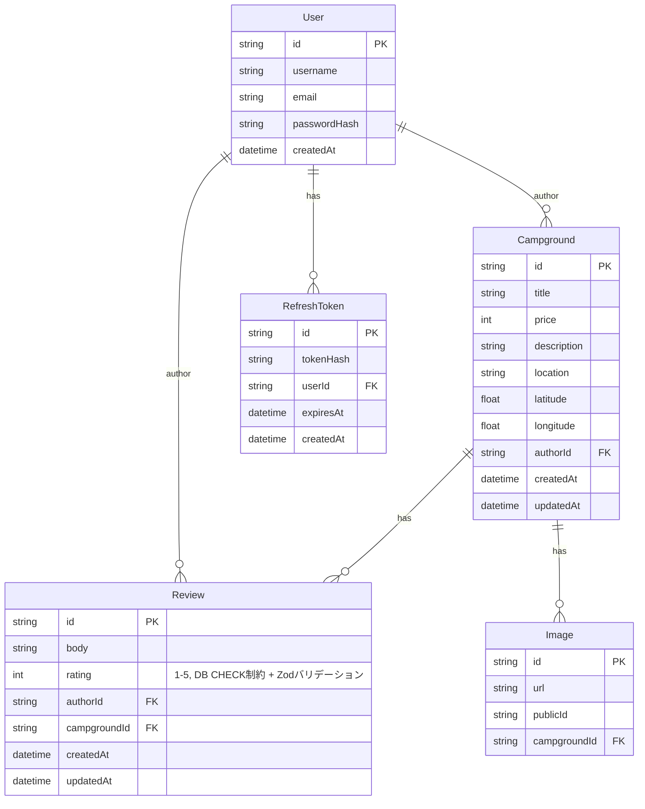

# Modern YelpCamp — 設計仕様書

> Web Developer Bootcamp の YelpCamp をモダンな技術スタックで作り替えるプロジェクト。
> 本ドキュメントは、他のセッション/エージェントが参加した際に前提を共有するための設計メモ。

## 1. プロジェクト概要

- 元ネタ: Colt Steele "Web Developer Bootcamp" の YelpCamp(キャンプ場のレビュー投稿サイト)
- ゴール: モダンな技術スタックで再実装する
- 開発規模の想定: 個人学習用途だが、**大規模開発を想定した構成**を採用する(フロントエンドとバックエンドを分離)

## 2. リポジトリ構成

```
modern-yelpcamp/
├── frontend/   # Next.js (App Router)
└── backend/    # Hono (現状: 未着手)
```

- frontend/backend は同一Gitリポジトリ内で別ディレクトリ管理(monorepoツールは現状未導入。将来的にTurborepo/Nx導入を検討)
- frontend は `create-next-app` で初期セットアップ済み(Next.js 16 / React 19 / TypeScript / Tailwind CSS v4)
- backend は未着手(このドキュメントの内容が初期方針)

## 3. 技術スタック

### フロントエンド

- Next.js (App Router, TypeScript)

### バックエンド

| 領域             | 採用技術                                                          | 理由                                                                                                       |
| ---------------- | ----------------------------------------------------------------- | ---------------------------------------------------------------------------------------------------------- |
| フレームワーク   | Hono (TypeScript)                                                 | 軽量・高速なWebフレームワーク。Node/Bun/edgeなど実行環境を選ばず、ミドルウェアベースでシンプルに構成できる |
| DB               | PostgreSQL                                                        | User-Campground-Review-Image のリレーショナルなデータ構造に適している                                      |
| ORM              | Drizzle ORM                                                       | Honoと組み合わせて使われることが多い定番構成。軽量でSQLに近い書き心地、型安全なクエリビルダ                |
| 認証             | JWT (access + refresh token) + `hono/jwt` ミドルウェア            | Hono標準搭載の軽量JWTミドルウェアで完結、NestのようなDIコンテナは不要                                      |
| 画像アップロード | Cloudinary                                                        | 元のYelpCampと同じ、導入コストが低い                                                                       |
| APIドキュメント  | `@hono/zod-openapi` + Swagger UI                                  | Zodスキーマからバリデーションとドキュメントを同時に生成できる                                              |
| バリデーション   | Zod                                                               | Honoエコシステムの定番。ルートハンドラの入出力スキーマをそのまま型として利用できる                         |
| テスト           | Vitest                                                            | Hono公式ドキュメント/テンプレートで標準的に使われる、高速で軽量                                            |
| インフラ         | Docker(ローカルDB起動用)。将来的にCI/CD・モノレポツール導入も検討 |                                                                                                            |

### 代替案として検討したが不採用のもの

- Next.js の Route Handlers / Server Actions のみで完結させる「フルスタックNext.js」構成
  - 個人開発では有力な選択肢だが、大規模開発(複数クライアント・チーム分業を想定)ではバックエンド分離の方が一般的と判断し不採用
- NestJS
  - DIコンテナやモジュール分割による構造化には魅力があるが、Honoのより軽量でシンプルな構成を優先し不採用

## 4. データモデル(初期案)

元のYelpCamp(MongoDB)の構造をリレーショナルDB向けに再設計。

> User-Campground-Review-Image-RefreshTokenの5テーブル構成(Commentは実装しない)。



> 詳細フィールドは実装フェーズでDrizzle schemaとして確定させる。

## 5. APIエンドポイント(初期案)

| メソッド | パス                             | 概要                                        | 認証要否               |
| -------- | -------------------------------- | ------------------------------------------- | ---------------------- |
| POST     | /auth/register                   | ユーザー登録                                | 不要                   |
| POST     | /auth/login                      | ログイン(JWT発行)                           | 不要                   |
| POST     | /auth/refresh                    | トークンリフレッシュ                        | 要リフレッシュトークン |
| GET      | /auth/me                         | ログイン中ユーザー情報取得                  | 要                     |
| POST     | /auth/logout                     | ログアウト(リフレッシュトークン無効化)      | 要                     |
| GET      | /campgrounds?search=             | 一覧取得(title部分一致検索)                 | 不要                   |
| GET      | /campgrounds/:id                 | 詳細取得                                    | 不要                   |
| POST     | /campgrounds                     | 新規作成                                    | 要                     |
| PATCH    | /campgrounds/:id                 | 更新(author本人のみ)                        | 要                     |
| DELETE   | /campgrounds/:id                 | 削除(author本人のみ)                        | 要                     |
| POST     | /campgrounds/:id/images          | 画像アップロード(author本人のみ、multipart) | 要                     |
| DELETE   | /campgrounds/:id/images/:imageId | 画像削除(author本人のみ)                    | 要                     |
| POST     | /campgrounds/:id/reviews         | レビュー投稿                                | 要                     |
| DELETE   | /reviews/:id                     | レビュー削除(author本人のみ)                | 要                     |

## 6. 実装ロードマップ

### Phase 1: 設計

1. データモデル確定(上記ER図をベースにDrizzle schema化)
2. APIエンドポイント確定

### Phase 2: バックエンド基盤構築

1. `backend/` に Hono プロジェクト作成(Node.js上で実行)
2. ESLint/Prettier、TypeScript設定
3. Docker ComposeでPostgreSQLをローカル起動
4. Drizzle導入(schema定義 → マイグレーション → Drizzle Client生成)

### Phase 3: コア機能実装

1. 認証(登録・ログイン・`hono/jwt`によるJWT発行・検証ミドルウェア)
2. Campground CRUD(Zodでリクエスト/レスポンスのスキーマ定義)
3. Review CRUD
4. Cloudinary連携(画像アップロード)
5. `@hono/zod-openapi` でAPIドキュメント自動生成

### Phase 4: 品質・連携

1. Vitestでユニット/E2Eテスト
2. CORS設定、frontendからの疎通確認
3. エラーハンドリング・認可整備

### Phase 5: 運用

1. Docker化、CI/CD、デプロイ設定

**次の一手**: Phase 2 (3〜6) — Honoプロジェクト作成 → Docker + PostgreSQL → Drizzle導入

## 7. 決定事項ログ

| 日付       | 決定内容                                                                                                                         | 理由                                                                                                                                                                  |
| ---------- | -------------------------------------------------------------------------------------------------------------------------------- | --------------------------------------------------------------------------------------------------------------------------------------------------------------------- |
| 2026-08-14 | フロントエンドはNext.js                                                                                                          | —                                                                                                                                                                     |
| 2026-08-14 | バックエンドはNext.jsから分離する                                                                                                | 大規模開発を想定したチーム分業・スケーラビリティのため                                                                                                                |
| 2026-08-14 | バックエンドはNestJS + PostgreSQL + Prisma                                                                                       | 型安全性・構造化・リレーショナルデータとの親和性(→後日Honoに変更)                                                                                                     |
| 2026-08-14 | バックエンドをNestJSからHono + Drizzleに変更                                                                                     | より軽量でシンプルな構成を希望。それに伴いバリデーション(Zod)、APIドキュメント(`@hono/zod-openapi`)、テスト(Vitest)、認証(`hono/jwt`)もHonoエコシステムに合わせて変更 |
| 2026-08-14 | データモデルはUser / Campground / Review / Imageの4テーブル構成とし、Comment機能は実装しない                                     | シンプルさを優先。レビューへの返信機能は現時点では不要と判断                                                                                                          |
| 2026-08-14 | リフレッシュトークンはハッシュ化して別テーブルRefreshTokenに保存する                                                             | Revoke(ログアウト・強制ログアウト)を可能にし、マルチデバイスログインにも対応するため                                                                                  |
| 2026-08-14 | CampgroundとReviewに`updatedAt`を追加する                                                                                        | Campgroundは編集APIがあるため必須。Reviewは現状削除のみだが、将来の編集API追加に備えて先に付けておく                                                                  |
| 2026-08-14 | Review.ratingの値域(1〜5)はDB CHECK制約とZodバリデーションの両方で担保する                                                       | 二重チェックによりデータ整合性をDBレベルでも保証するため                                                                                                              |
| 2026-08-14 | `GET /auth/me`と`POST /auth/logout`をAPIエンドポイントに追加する                                                                 | RefreshTokenテーブル導入に伴いログアウト時のトークン無効化が必須になったため。/auth/meはログイン状態判定の定番エンドポイント                                          |
| 2026-08-14 | 画像アップロード/削除は`POST /campgrounds/:id/images`・`DELETE /campgrounds/:id/images/:imageId`として専用エンドポイントに分ける | Campground本体の作成/更新APIをJSONのみでシンプルに保つため。multipart処理を画像専用ルートに閉じ込める                                                                 |
| 2026-08-14 | `GET /campgrounds`にtitle部分一致の`search`クエリパラメータを追加する                                                            | 元のYelpCampと同等のシンプルな検索機能。ページネーションは現時点の規模では過剰と判断し見送り                                                                          |

## 8. Open Questions

- モノレポツール(Turborepo/Nx)を導入するか
- GraphQL採用の是非(現時点ではREST + Swaggerを採用)
- デプロイ先(Vercel + 別ホスティング? 単一クラウド?)
